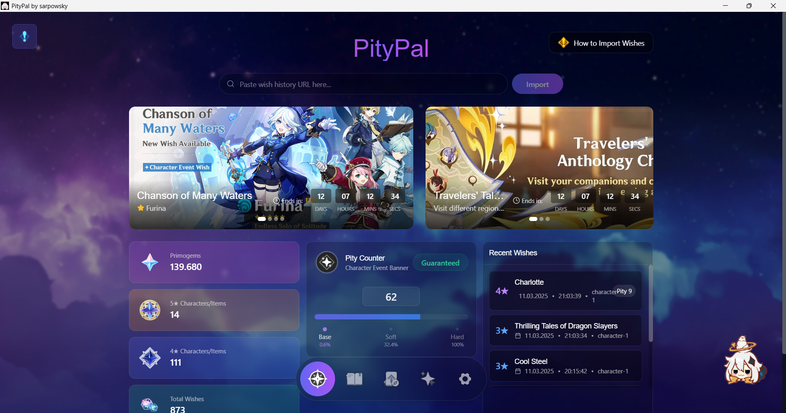
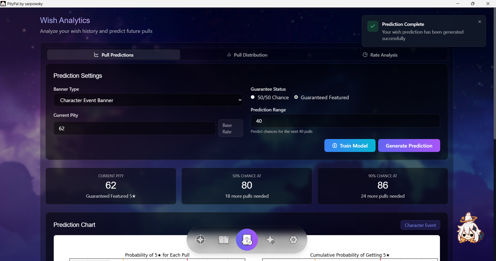
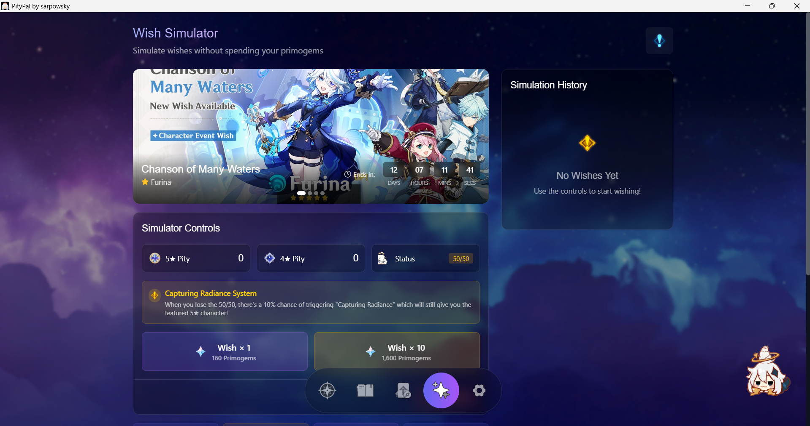
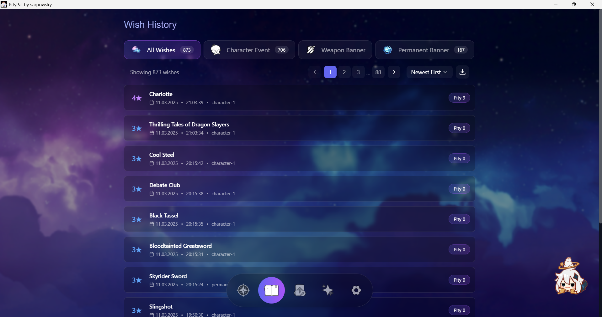

# PityPal

  
  <h3>Your Personalized Genshin Impact Wish Tracker</h3>

PityPal is a desktop application designed to track and analyze your Genshin Impact wish history. It provides detailed analytics, pity tracking, and uses machine learning to predict your chances of getting 5★ characters and weapons.

## ✨ Features

- **Wish Import**: Import your wish history directly from the game with a simple URL
- **Pity Tracking**: Monitor your pity counters for all banner types
- **Analytics**: Visualize your wish patterns, 5★ rates, and pull distribution
- **Predictions**: ML-powered predictions for your chances of getting a 5★ in upcoming pulls
- **Wish Simulator**: Test your luck without spending primogems
- **Banners & Events**: Keep track of active banners and events
- **Reminders**: Set notifications for banner endings and events
- **Leaks Section**: View upcoming game content directly in the app
- **Capturing Radiance System**: 10% chance to get featured characters even when losing 50/50
- **Offline Mode**: Use cached data when no internet connection is available

## 📸 Screenshots

  
  

  
  

## 🚀 Installation

### System Requirements
- Windows 10 or newer
- 4GB RAM
- 200MB free disk space

### Download and Install
1. Download the latest version from the [Releases](https://github.com/sarpowsky/PityPal/releases) page
2. Run the `PityPal_Setup.exe` installer
3. Follow the installation prompts
4. Launch PityPal from your desktop or start menu

## 📖 Usage Guide

### Importing Wish History
1. Open Genshin Impact and navigate to the wish history page
2. Click the "How to Import Wishes" button on the home screen
3. Follow the instructions to get your wish history URL
4. Paste the URL into PityPal and click "Import"

### Tracking Pity
- The home screen shows your current pity for character and weapon banners
- The status indicator shows whether you're on 50/50 or guaranteed pity
- Soft pity and hard pity thresholds are clearly marked

### Analytics
- View detailed analysis of your wish history
- See 5★ and 4★ pity distribution charts
- Compare your pull rates against expected probabilities
- Train the ML model for personalized predictions

### Wish Simulator
- Test pull strategies without spending actual primogems
- Accurate simulation of banner mechanics including:
  - Soft pity rates
  - 50/50 system
  - Guaranteed pity
  - "Capturing Radiance" mechanic (10% chance to get featured character when losing 50/50)

### Viewing Leaks
- Access the latest leaks for upcoming banners, characters, and events
- Information is regularly updated via Firebase Remote Config
- Data is cached for offline viewing

## 🧪 Technical Details

PityPal is built with:
- **Frontend**: React, Tailwind CSS, Recharts
- **Backend**: Python, SQLite
- **Machine Learning**: scikit-learn for wish prediction
- **Framework**: PyWebView for desktop integration
- **Content Delivery**: Firebase Remote Config and Storage

## 🔮 Future Plans

- Sound integration with wish animations and UI interactions
- Overall improved UI with additional themes and customization
- Fix for audio system currently present in settings but non-functional
- Expanded pity tracking for all banner types
- Comprehensive notification system for various in-game events

## 📝 License

This project is licensed under the GNU General Public License v3.0 (GPLv3) - see the [LICENSE](LICENSE) file for details.

## ⚠️ Disclaimer

PityPal is a fan-made application and is not affiliated with HoYoverse or Genshin Impact. All game assets and references are property of HoYoverse.

## 🔍 Known Issues

- Audio system exists in the settings as a placeholder, but doesn't work currently
- Current pity counter only shows character-1 and character-2 banners
- Some network-dependent features may not work correctly in offline mode

## 🙏 Acknowledgements

- All the travelers who provided feedback and testing
- [PyWebView](https://pywebview.flowrl.com/) for making desktop app development with Python and web technologies seamless
- The Genshin Impact community for documentation of wish mechanics

---

  Made with ❤️ by <a href="https://github.com/sarpowsky">sarpowsky</a>

